# Aplicação Desktop Java - Sistema de Reservas de Hotel

Este programa integra funções gráficas com lógica para a execução de um sistema de reservas de hotel aplicando padrões de controle para maximizar o uso do projeto.

### 🖥️ Tecnologías Utilizadas:

Java

Eclipse

Biblioteca JCalendar

MySql

Plugin WindowBuilder

mariadb-java-client-3.1.1.jar

***

### ⚠️ Importante! ⚠️

Compativel com Java versão 8 ou superior.

#### Requer a importação das seguinte bibliotecas externas:

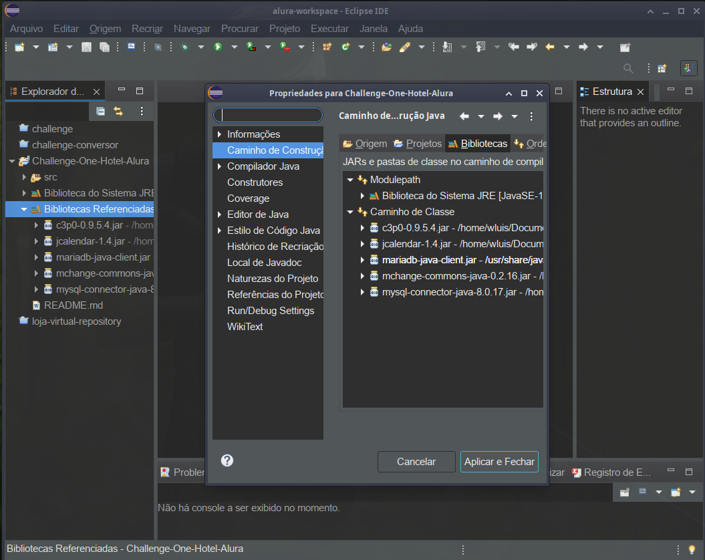

#### Requer a importação da biblioteca externa do mariadb. (mariadb-java-client-3.1.1.jar).

#### Requer a criação previa de um banco de dados com duas tabelas, as quais devem ser configuradas no arquivo ConnectionFactory.java:

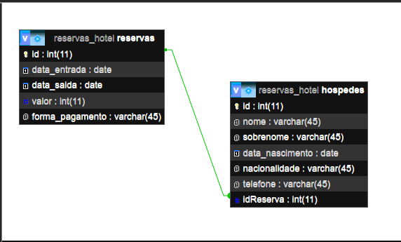

#### 🎨 A interface contém dois métodos importantes:

setResizable(false): determina o tamanho da janela,  através do parâmetro false, a janela não maximiza.

setLocationRelativeTo(null): determina localização da janela e, por meio do parâmetro null, a mantém centralizada na tela.

***

### A janela com a qual o aplicativo deve ser iniciado é o Menu Principal (MenuPrincipal.java):

***

A partir do qual você pode continuar graficamente para o Login:

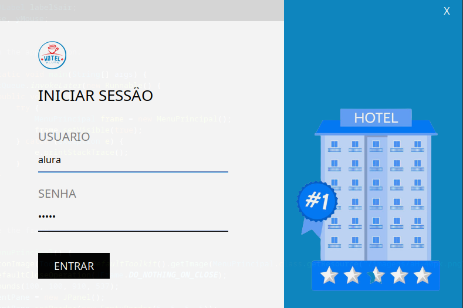

#### Os dados definidos para poder validar a entrada são:
Usuario= alura

Senha= alura

***

Uma vez introduzidos os dados de acesso, a aplicação permitirá optar por criar uma reserva ou efetuar uma pesquisa de reserva existente ou registo de hóspede.

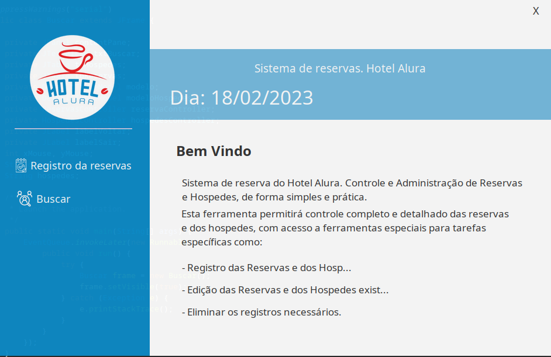

#### Registro de Reserva

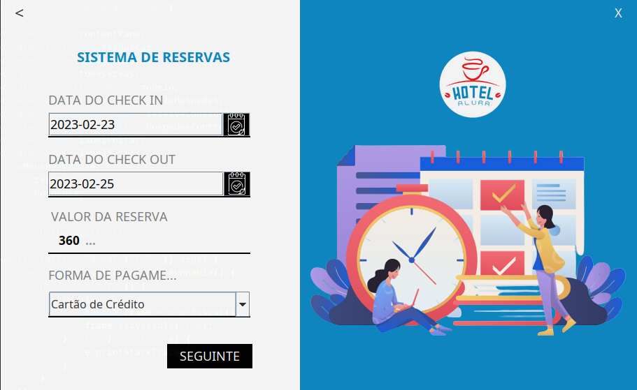 

***

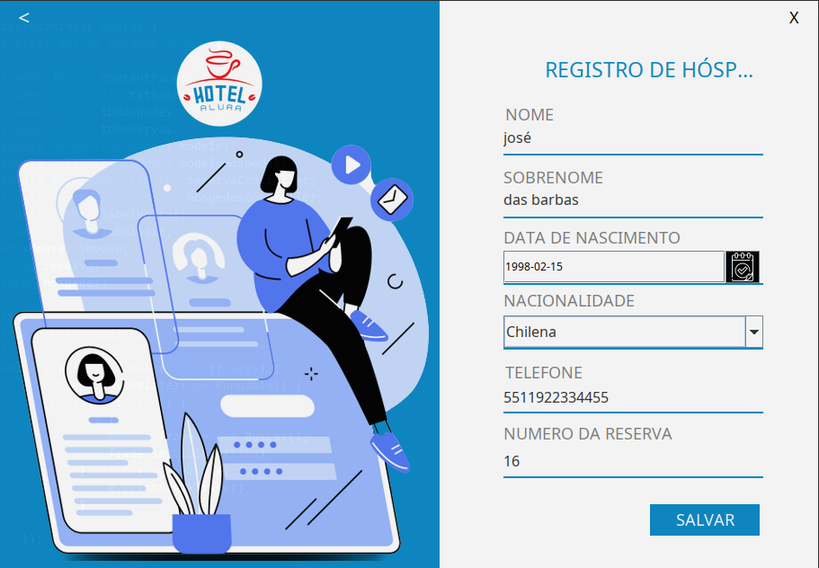

***

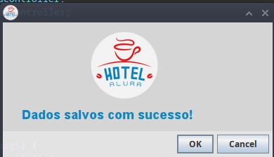

***

Se você escolheu a opção Pesquisar, pode optar por editar ou excluir o registro selecionado ou realizar uma pesquisa específica por número de identificação..

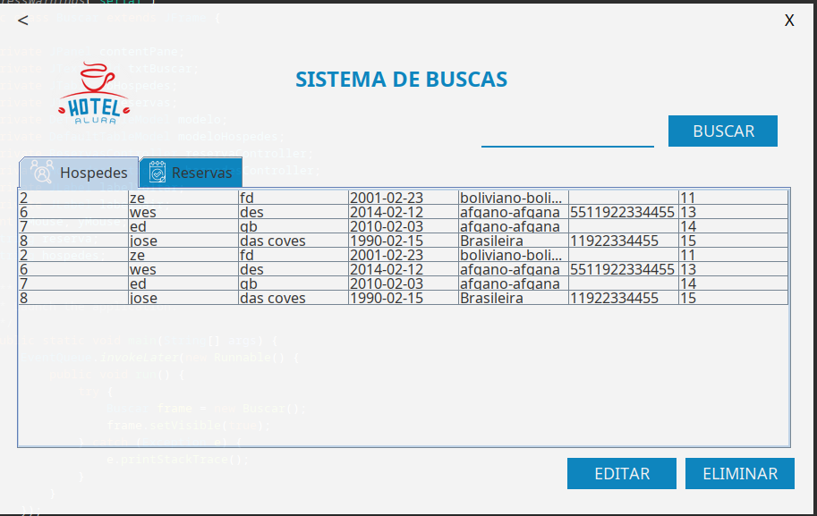

***

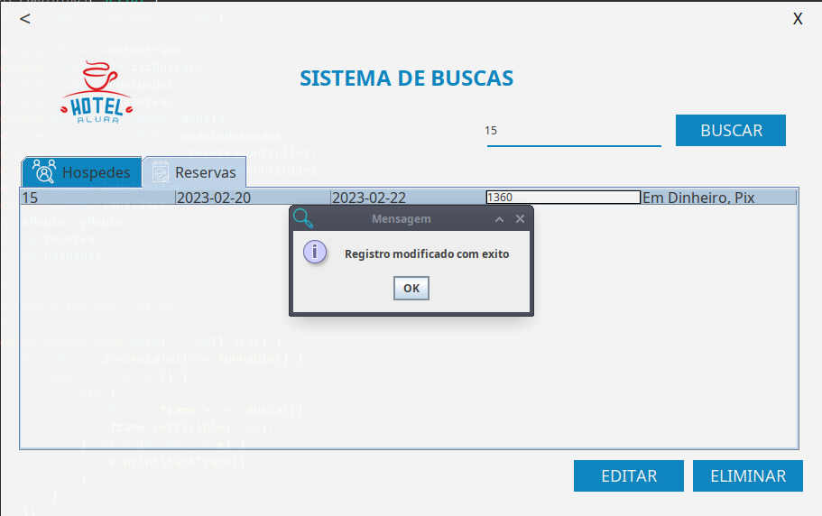

***

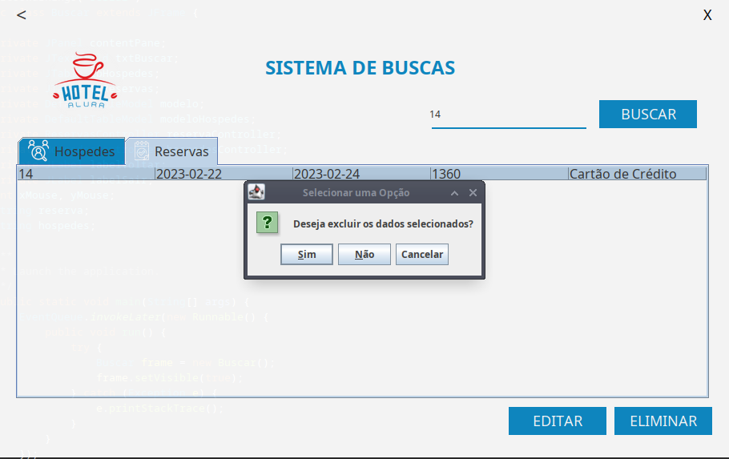

***

***

Por fim, você pode voltar ou fechar o aplicativo com os ícones disponíveis na parte superior de cada janela.

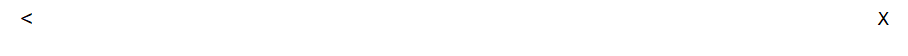

